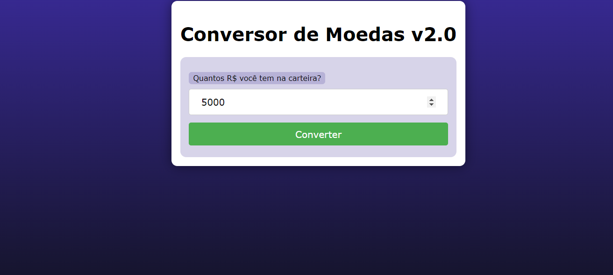
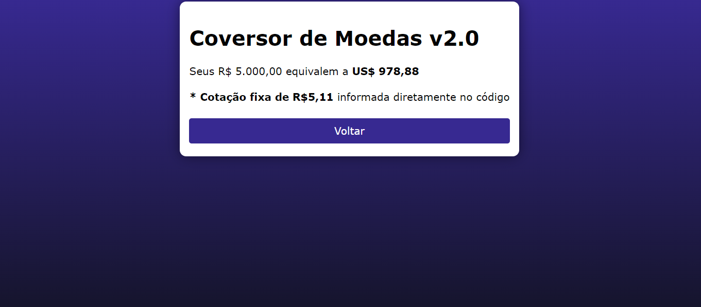

# CONVERSOR DE MOEDAS AVANCADO
👨‍🏫PROJETO CRIADO PARA O CURSO DE PHP.

  
  

## DESCRIÇÃO:
Este é um aplicativo avançado de conversão de moedas que permite ao usuário converter uma quantidade em reais para dólares americanos com base na cotação atual do dólar. 

- Exibe um formulário solicitando ao usuário que insira a quantidade de reais que deseja converter para dólares.
- O formulário envia os dados para o arquivo `cod.php` usando o método GET quando o botão "Converter" é clicado.
- Recebe a quantidade de reais fornecida pelo usuário.
- Obtém a cotação atual do dólar utilizando a API do Banco Central do Brasil para buscar a cotação mais recente.
- Converte a quantidade de reais para dólares americanos com base na cotação atual do dólar.
- Exibe o resultado da conversão para o usuário, indicando quantos dólares americanos a quantidade de reais fornecida equivale.
- Fornece um botão "Voltar" que permite ao usuário retornar à página de formulário para realizar outra conversão, se desejar.

## EXECUTANDO O PROJETO:
1. **Executando o Aplicativo:**
   - Coloque os arquivos em um servidor web compatível com PHP (por exemplo, XAMPP, WAMP, LAMP).
   - Acesse o formulário no navegador visitando `http://localhost/CODIGO/index.php`.

2. **Interagir com o Projeto:**
   1. Insira a quantidade de reais que deseja converter para dólares no campo fornecido.
   2. Clique no botão "Converter" para enviar o formulário.
   3. Após o processamento, você será redirecionado para uma página que exibirá o valor convertido em dólares com base na cotação atual.
   4. Se desejar realizar outra conversão, você pode clicar no botão "Voltar" para retornar à página de formulário e inserir outra quantidade de reais.
   
## CREDITOS:
- [PROJETO CRIADO PARA O CURSO DE PHP](https://github.com/VILHALVA/CURSO-DE-PHP)
- [PROJETO FEITO PELO VILHALVA](https://github.com/VILHALVA)

